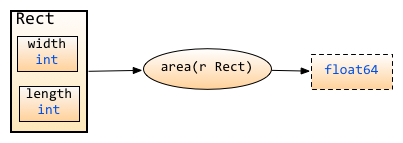
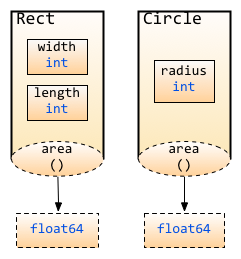

# 2.5 物件導向

前面兩章我們介紹了函式和 struct，那你是否想過函式當作 struct 的欄位一樣來處理呢？今天我們就講解一下函式的另一種形態，帶有接收者的函式，我們稱為`method`

## method

現在假設有這麼一個場景，你定義了一個 struct 叫做長方形，你現在想要計算他的面積，那麼按照我們一般的思路應該會用下面的方式來實現

```Go
package main

import "fmt"

type Rectangle struct {
	width, height float64
}

func area(r Rectangle) float64 {
	return r.width*r.height
}

func main() {
	r1 := Rectangle{12, 2}
	r2 := Rectangle{9, 4}
	fmt.Println("Area of r1 is: ", area(r1))
	fmt.Println("Area of r2 is: ", area(r2))
}
```
這段程式碼可以計算出來長方形的面積，但是 area()不是作為 Rectangle 的方法實現的（類似物件導向裡面的方法），而是將 Rectangle 的物件（如 r1,r2）作為參數傳入函式計算面積的。

這樣實現當然沒有問題囉，但是當需要增加圓形、正方形、五邊形甚至其它多邊形的時候，你想計算他們的面積的時候怎麼辦啊？那就只能增加新的函式囉，但是函式名你就必須要跟著換了，變成`area_rectangle, area_circle, area_triangle...`

像下圖所表示的那樣， 橢圓代表函式, 而這些函式並不從屬於 struct(或者以物件導向的術語來說，並不屬於 class)，他們是單獨存在於 struct 外圍，而非在概念上屬於某個 struct 的。



圖 2.8 方法和 struct 的關係圖

很顯然，這樣的實現並不優雅，並且從概念上來說"面積"是"形狀"的一個屬性，它是屬於這個特定的形狀的，就像長方形的長和寬一樣。

基於上面的原因所以就有了 `method` 的概念，`method`是附屬在一個給定的型別上的，他的語法和函式的宣告語法幾乎一樣，只是在 `func` 後面增加了一個 receiver (也就是 method 所依從的主體)。

用上面提到的形狀的例子來說，method `area()` 是依賴於某個形狀(比如說 Rectangle)來發生作用的。Rectangle.area()的發出者是 Rectangle， area()是屬於 Rectangle 的方法，而非一個外圍函式。

更具體地說，Rectangle 存在欄位 height 和 width, 同時存在方法 area(), 這些欄位和方法都屬於 Rectangle。

用 Rob Pike 的話來說就是：

>"A method is a function with an implicit first argument, called a receiver."

method 的語法如下：

	func (r ReceiverType) funcName(parameters) (results)

下面我們用最開始的例子用 method 來實現：

```Go
package main

import (
	"fmt"
	"math"
)

type Rectangle struct {
	width, height float64
}

type Circle struct {
	radius float64
}

func (r Rectangle) area() float64 {
	return r.width*r.height
}

func (c Circle) area() float64 {
	return c.radius * c.radius * math.Pi
}


func main() {
	r1 := Rectangle{12, 2}
	r2 := Rectangle{9, 4}
	c1 := Circle{10}
	c2 := Circle{25}

	fmt.Println("Area of r1 is: ", r1.area())
	fmt.Println("Area of r2 is: ", r2.area())
	fmt.Println("Area of c1 is: ", c1.area())
	fmt.Println("Area of c2 is: ", c2.area())
}

```

在使用 method 的時候重要注意幾點

- 雖然 method 的名字一模一樣，但是如果接收者不一樣，那麼 method 就不一樣
- method 裡面可以訪問接收者的欄位
- 呼叫 method 透過`.`訪問，就像 struct 裡面訪問欄位一樣

圖示如下:



圖 2.9 不同 struct 的 method 不同

在上例，method area() 分別屬於 Rectangle 和 Circle， 於是他們的 Receiver 就變成了 Rectangle 和 Circle, 或者說，這個 area()方法 是由 Rectangle/Circle 發出的。

>值得說明的一點是，圖示中 method 用虛線標出，意思是此處方法的 Receiver 是以值傳遞，而非參考傳遞，是的，Receiver 還可以是指標, 兩者的差別在於, 指標作為 Receiver 會對實體物件的內容發生操作，而普通型別作為 Receiver 僅僅是以副本作為操作物件，並不對原實體物件發生操作。後文對此會有詳細論述。

那是不是 method 只能作用在 struct 上面呢？當然不是囉，他可以定義在任何你自訂的型別、內建型別、struct 等各種型別上面。這裡你是不是有點迷糊了，什麼叫自訂型別，自訂型別不就是 struct 嘛，不是這樣的哦，struct 只是自訂型別裡面一種比較特殊的型別而已，還有其他自訂型別宣告，可以透過如下這樣的宣告來實現。

```Go
type typeName typeLiteral
```
請看下面這個宣告自訂型別的程式碼

```Go
type ages int

type money float32

type months map[string]int

m := months {
	"January":31,
	"February":28,
	...
	"December":31,
}
```
看到了嗎？簡單的很吧，這樣你就可以在自己的程式碼裡面定義有意義的型別了，實際上只是一個定義了一個別名，有點類似於 c 中的 typedef，例如上面 ages 替代了 int

好了，讓我們回到`method`

你可以在任何的自訂型別中定義任意多的`method`，接下來讓我們看一個複雜一點的例子

```Go
package main

import "fmt"

const(
	WHITE = iota
	BLACK
	BLUE
	RED
	YELLOW
)

type Color byte

type Box struct {
	width, height, depth float64
	color Color
}

type BoxList []Box //a slice of boxes

func (b Box) Volume() float64 {
	return b.width * b.height * b.depth
}

func (b *Box) SetColor(c Color) {
	b.color = c
}

func (bl BoxList) BiggestColor() Color {
	v := 0.00
	k := Color(WHITE)
	for _, b := range bl {
		if bv := b.Volume(); bv > v {
			v = bv
			k = b.color
		}
	}
	return k
}

func (bl BoxList) PaintItBlack() {
	for i := range bl {
		bl[i].SetColor(BLACK)
	}
}

func (c Color) String() string {
	strings := []string {"WHITE", "BLACK", "BLUE", "RED", "YELLOW"}
	return strings[c]
}

func main() {
	boxes := BoxList {
		Box{4, 4, 4, RED},
		Box{10, 10, 1, YELLOW},
		Box{1, 1, 20, BLACK},
		Box{10, 10, 1, BLUE},
		Box{10, 30, 1, WHITE},
		Box{20, 20, 20, YELLOW},
	}

	fmt.Printf("We have %d boxes in our set\n", len(boxes))
	fmt.Println("The volume of the first one is", boxes[0].Volume(), "cm³")
	fmt.Println("The color of the last one is",boxes[len(boxes)-1].color.String())
	fmt.Println("The biggest one is", boxes.BiggestColor().String())

	fmt.Println("Let's paint them all black")
	boxes.PaintItBlack()
	fmt.Println("The color of the second one is", boxes[1].color.String())

	fmt.Println("Obviously, now, the biggest one is", boxes.BiggestColor().String())
}
```
上面的程式碼透過 const 定義了一些常數，然後定義了一些自訂型別

- Color 作為 byte 的別名
- 定義了一個 struct:Box，含有三個長寬高欄位和一個顏色屬性
- 定義了一個 slice:BoxList，含有 Box

然後以上面的自訂型別為接收者定義了一些 method

- Volume()定義了接收者為 Box，回傳 Box 的容量
- SetColor(c Color)，把 Box 的顏色改為 c
- BiggestColor()定在在 BoxList 上面，回傳 list 裡面容量最大的顏色
- PaintItBlack()把 BoxList 裡面所有 Box 的顏色全部變成黑色
- String()定義在 Color 上面，回傳 Color 的具體顏色(字串格式)

上面的程式碼透過文字描述出來之後是不是很簡單？我們一般解決問題都是透過問題的描述，去寫相應的程式碼實現。

### 指標作為 receiver

現在讓我們回過頭來看看 SetColor 這個 method，它的 receiver 是一個指向 Box 的指標，是的，你可以使用*Box。想想為啥要使用指標而不是 Box 本身呢？

我們定義 SetColor 的真正目的是想改變這個 Box 的顏色，如果不傳 Box 的指標，那麼 SetColor 接受的其實是 Box 的一個 copy，也就是說 method 內對於顏色值的修改，其實只作用於 Box 的 copy，而不是真正的 Box。所以我們需要傳入指標。

這裡可以把 receiver 當作 method 的第一個參數來看，然後結合前面函式講解的傳值和傳參考就不難理解

這裡你也許會問了那 SetColor 函式裡面應該這樣定義`*b.Color=c`，而不是`b.Color=c`，因為我們需要讀取到指標相應的值。

你是對的，其實 Go 裡面這兩種方式都是正確的，當你用指標去訪問相應的欄位時(雖然指標沒有任何的欄位)，Go 知道你要透過指標去取得這個值，看到了吧，Go 的設計是不是越來越吸引你了。

也許細心的讀者會問這樣的問題，PaintItBlack 裡面呼叫 SetColor 的時候是不是應該寫成`(&bl[i]).SetColor(BLACK)`，因為 SetColor 的 receiver 是*Box，而不是 Box。

你又說對了，這兩種方式都可以，因為 Go 知道 receiver 是指標，他自動幫你轉了。

也就是說：
>如果一個 method 的 receiver 是 *T，你可以在一個 T 型別的變數 V 上面呼叫這個 method，而不需要 &V 去呼叫這個 method

類似的
>如果一個 method 的 receiver 是 T，你可以在一個*T 型別的變數 P 上面呼叫這個 method，而不需要 *P 去呼叫這個 method

所以，你不用擔心你是呼叫的指標的 method 還是不是指標的 method，Go 知道你要做的一切，這對於有多年 C/C++程式設計經驗的同學來說，真是解決了一個很大的痛苦。

### method 繼承

前面一章我們學習了欄位的繼承，那麼你也會發現 Go 的一個神奇之處，method 也是可以繼承的。如果匿名欄位實現了一個 method，那麼包含這個匿名欄位的 struct 也能呼叫該 method。讓我們來看下面這個例子

```Go
package main

import "fmt"

type Human struct {
	name string
	age int
	phone string
}

type Student struct {
	Human //匿名欄位
	school string
}

type Employee struct {
	Human //匿名欄位
	company string
}

//在 human 上面定義了一個 method
func (h *Human) SayHi() {
	fmt.Printf("Hi, I am %s you can call me on %s\n", h.name, h.phone)
}

func main() {
	mark := Student{Human{"Mark", 25, "222-222-YYYY"}, "MIT"}
	sam := Employee{Human{"Sam", 45, "111-888-XXXX"}, "Golang Inc"}

	mark.SayHi()
	sam.SayHi()
}
```

### method 重寫

上面的例子中，如果 Employee 想要實現自己的 SayHi，怎麼辦？簡單，和匿名欄位衝突一樣的道理，我們可以在 Employee 上面定義一個 method，重寫了匿名欄位的方法。請看下面的例子

```Go
package main

import "fmt"

type Human struct {
	name string
	age int
	phone string
}

type Student struct {
	Human //匿名欄位
	school string
}

type Employee struct {
	Human //匿名欄位
	company string
}

//Human 定義 method
func (h *Human) SayHi() {
	fmt.Printf("Hi, I am %s you can call me on %s\n", h.name, h.phone)
}

//Employee 的 method 重寫 Human 的 method
func (e *Employee) SayHi() {
	fmt.Printf("Hi, I am %s, I work at %s. Call me on %s\n", e.name,
		e.company, e.phone) //Yes you can split into 2 lines here.
}

func main() {
	mark := Student{Human{"Mark", 25, "222-222-YYYY"}, "MIT"}
	sam := Employee{Human{"Sam", 45, "111-888-XXXX"}, "Golang Inc"}

	mark.SayHi()
	sam.SayHi()
}
```
上面的程式碼設計的是如此的美妙，讓人不自覺的為 Go 的設計驚歎！

透過這些內容，我們可以設計出基本的物件導向的程式了，但是 Go 裡面的物件導向是如此的簡單，沒有任何的私有、公有關鍵字，透過大小寫來實現(大寫開頭的為公有，小寫開頭的為私有)，方法也同樣適用這個原則。

## links

   * [目錄](<preface.md>)
   * 上一節：[struct 型別](<02.4.md>)
   * 下一節：[interface](<02.6.md>)
